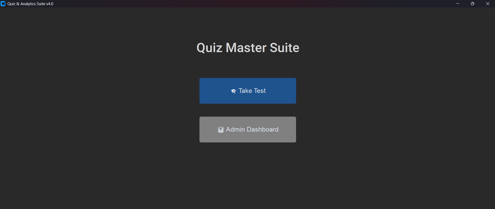
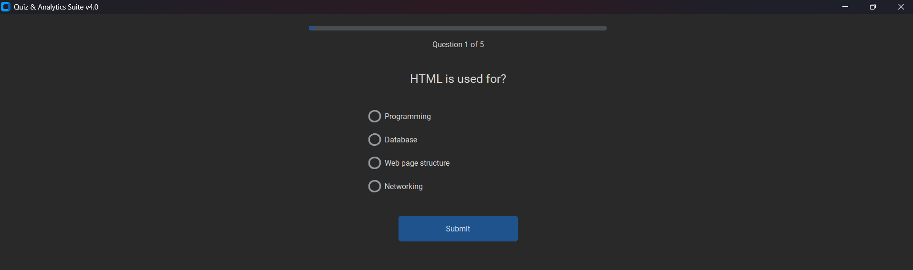
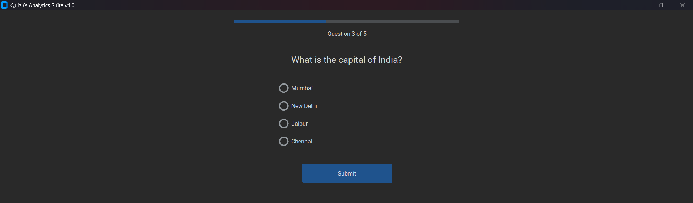

# 🎯 Quiz App with Performance Analysis

A modern **Python-based Quiz Application** built using **CustomTkinter** that allows users to take quizzes while providing administrators with a comprehensive analytics dashboard to monitor performance, visualize results, and export records.

---

## 🚀 Features

### 👨‍🎓 User Module
- 📝 Interactive multiple-choice quiz
- 👤 User name authentication
- 📊 Real-time score calculation
- 📈 Performance tracking
- 🔄 Option to retake the quiz
- 💾 Automatic result storage

### 👨‍💼 Admin Module
- 🔐 Secure Admin Login
- 📊 Analytics Dashboard
- 📈 Performance Overview
- 📉 Detailed Analysis
- 📋 Student Records
- 📤 Export Records to Excel
- 👥 Add New Admin

---

# 🖼️ Application Screenshots

## 🏠 Home Screen



---

## 👤 Admin Login


---

## 📝 Quiz Start



---

## 📚 Quiz Questions



---

## 🎉 Score Screen


---

## 📊 Admin Dashboard (Overview)


---

## 📈 Detailed Analytics


---

## 📋 Records & Export


---

## 🛠️ Technologies Used

| Technology | Purpose |
|------------|---------|
| Python | Core Programming Language |
| CustomTkinter | Modern GUI Framework |
| Pandas | Data Processing |
| Matplotlib | Data Visualization |
| OpenPyXL | Excel File Handling |
| CSV | Data Storage |

---

# 📂 Project Structure

```text
Quiz-App-Analysis
│
├── assets/
│   ├── home_screen.png
│   ├── login_screen.png
│   ├── quiz_question1.png
│   ├── quiz_question2.png
│   ├── score_screen.png
│   ├── Overview_page.png
│   ├── DetailedAnalysis_page.png
│   ├── Record&Export_page.png
│   └── admin_dashboard.png
│
├── quiz_gui_final.py
├── quiz_gui.py
├── example_gui.py
├── example1_gui.py
├── exta_gui.py
│
├── admin_credentials.xlsx
├── quiz_results_flat.xlsx
├── quiz_results.csv
├── quiz_log.csv
│
├── requirements.txt
├── README.md
└── .gitignore
```

---

# ⚙️ Installation

### 1️⃣ Clone the Repository

```bash
git clone https://github.com/naina2510/Quiz-App-Analysis.git
```

---

### 2️⃣ Navigate to the Project

```bash
cd Quiz-App-Analysis
```

---

### 3️⃣ Install Dependencies

```bash
pip install -r requirements.txt
```

---

### 4️⃣ Run the Application

```bash
python quiz_gui_final.py
```

---

# 📈 Analytics Dashboard

The Admin Dashboard provides:

- 📊 Overall Performance Statistics
- 📉 Score Distribution
- 🥧 Pass vs Fail Ratio
- 📅 Daily Performance Trend
- 🔥 Hardest Questions Analysis
- 📋 Student Record Management
- 📤 Excel Export Facility

---

# 🎯 Future Improvements

- 🌐 Online Database Integration
- ☁️ Cloud Storage
- 👥 User Registration
- ⏱️ Timer-Based Quiz
- 📧 Email Notifications
- 🏆 Leaderboard
- 📱 Responsive Design
- 🔐 Password Encryption

---

# 👩‍💻 Author

**Naina Dadheech**

B.Tech Computer Science & Engineering  
Specialization: Data Science & Machine Learning

---

# ⭐ Support

If you found this project useful, consider giving it a ⭐ on GitHub!
